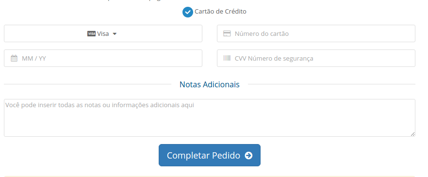

# Iugu WHMCS Pro

O Módulo para WHMCS Iugu Pro desenvolvido pela [EunaRede](https://www.eunarede.com) proporciona uma integração completa e transparente com o gateway de pagamento [Iugu](https://iugu.com)

Este módulo consiste em dois métodos de pagamento diferentes, boleto bancário e cartão de crédito, confira os recursos a seguir:

## Módulo Cartão de Crédito

Através do método de pagamento por cartão de crédito do Módulo WHMCS Iugu Pro, é possível realizar o recebimento de faturas via cartão de crédito diretamente no WHMCS, sem necessidade de redirecionamento. O módulo utiliza os campos originais de cartão de crédito do WHMCS sem necessidade de modificação no tema.

Ao realizar um pedido ou na atualização do cartão de crédito no perfil de um cliente já existente, o módulo captura os dados do cartão e utilizando a API da Iugu, gera um código único criptogrado: o token de pagamento.

Os dados do cartão de crédito são criptografados e armazenados nos servidores da Iugu, gerando um token de representação destes dados, que são atrelados ao cliente dentro do sistema da Iugu. Este token então é armazenado no WHMCS e vinculado a conta do cliente no WHMCS.

Através do token de pagamento, o WHMCS poderá realizar capturas automáticas de pedidos e cobranças recorrentes de faturas no cartão de crédito. O WHMCS armazena apenas a data de vencimento do cartão, os 4 últimos digitos e bandeira (estas informações são utilizadas para alertas de vencimento do cartão).

### Com este módulo você poderá:

* Realizar a cobrança da fatura sem redirecionar o cliente para o site da Iugu;
* Capturar os cartão de crédito de forma transparente;
* Capturar faturas recorrentes automaticamente;
* Cadastrar o cliente do WHMCS na Iugu automaticamente;
* Excluir o cliente na Iugu quando excluido no WHMCS;
* Atualizar os dados do cartão do cliente diretamente no WHMCS;

## Módulo Boleto Bancário

Através do método de pagamento por boleto bancário do Módulo WHMCS Iugu Pro, é possível gerar o boleto diretamente no WHMCS, sem necessidade de redirecionamento.

### Com este módulo você poderá:

* Gerar o boleto sem redirecionar o cliente para o site da Iugu;
* Dar baixa na fatura automaticamente após a compensação (retorno automático);
* Cadastrar o cliente do WHMCS na Iugu automaticamente;
* Excluir o cliente na Iugu quando excluido no WHMCS;

## Instalação

Acesse a instalação [aqui](docs/instalacao.md)

# Requerimentos

* WHMCS 6.x ou superior

## Créditos e isenções

Este módulo é entregue "como está", a EunaRede ou sua equipe não se responsabilizam por qualquer eventual projuízo ou perda de qualquer natureza que este plugin ou a sua utilização possam estar associados.

A EunaRede e nenhum de seus membros estão associados ou vinculados de alguma maneira com a Iugu. Este desenvolvido é de livre iniciativa e independente.
